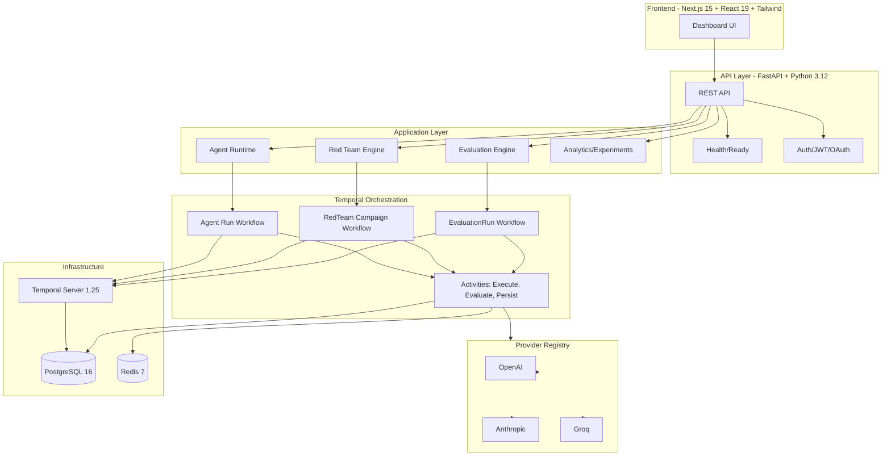

# RedOps

Production-grade platform for LLM evaluation, red teaming, safety testing, and observability.

[](https://www.python.org/)
[](https://fastapi.tiangolo.com/)
[](https://nextjs.org/)
[](https://www.postgresql.org/)
[](https://redis.io/)
[](https://temporal.io/)
[](LICENSE)

## Overview

RedOps is a production-oriented AI evaluation and safety platform. It combines:

- **Evaluation engine** — dataset-driven LLM evaluation with a pluggable metric framework, LLM-as-a-judge, and full cost/token provenance
- **Red teaming** — adaptive adversarial campaigns with mutation strategies, semantic judging, and durable round persistence
- **Agent evaluation** — trajectory-based assessment of tool-calling agents
- **Experiments** — baselines, comparisons, and regression analysis
- **Observability** — execution traces, replay, metric provenance, and replay-based comparison

Modern LLM systems require more than prompt engineering. They demand repeatable evaluation, adversarial validation, and execution guarantees. RedOps provides the infrastructure to run evaluations you can trust, red-team campaigns that adapt, and observability that makes failures explainable.

## Core Capabilities

### Evaluation Engine

- **Dataset & single-item execution** — run evaluations against structured datasets or individual prompts
- **Pluggable metric framework** — 24 built-in metrics: groundedness, faithfulness, answer relevance, context relevance, hallucination, toxicity, bias, safety, prompt injection, jailbreak, correctness, schema validation, semantic similarity, semantic effectiveness, cost, latency, token usage, tool-call correctness, reasoning quality, coherence, JSON validity, regex validation, response length, instruction following — plus composable composite metrics
- **LLM-as-a-judge** — semantic effectiveness, safety, and custom rubric-based evaluation with structured JSON parsing, confidence scoring, and cost tracking
- **Provider-neutral execution** — unified interface across OpenAI, Anthropic, and Groq with automatic provider registration via API keys
- **Cost & token provenance** — per-request cost estimation with real provider pricing, cached-token awareness, and end-to-end accounting
- **Durable execution** — Temporal-orchestrated runs with automatic retries, idempotent item execution, checkpointing, and exactly-once metric persistence
- **Retry & failure semantics** — circuit breaker, rate limiting, timeout enforcement, fatal vs. retryable error classification

### Red Teaming

- **Adaptive campaigns** — generate→execute→evaluate→mutate loops with configurable budgets (rounds, attacks, tokens, cost, duration)
- **Mutation strategies** — template-based, LLM-driven, and heuristic mutations with lineage tracking
- **Semantic effectiveness judging** — LLM judge evaluates attack success against safety dimensions (safety, prompt injection, jailbreak, toxicity, bias)
- **Durable round persistence** — every round checkpointed to PostgreSQL; campaigns resume from last completed round after interruption
- **Cancellation & resume** — cooperative cancellation with state preservation; terminal campaigns reconstruct without re-executing providers
- **Finding detection** — violation and severe-violation classification with per-round evidence (prompts, responses, judge reasoning)

### Agent Evaluation

- **Trajectory-based assessment** — tool selection correctness, error recovery, efficiency, completeness metrics
- **Tool-calling contracts** — unified provider-agnostic tool calling interface with structured argument/result validation
- **Runtime replay** — agent step execution traces with provider call provenance

### Experiments

- **Profile & baseline management** — versioned evaluation configurations for reproducible comparison
- **Regression analysis** — fingerprint-based compatibility checks, metric delta computation, statistical tolerance thresholds
- **Leaderboards & trends** — aggregated metric comparison across runs and models

### Observability & Provenance

- **Execution traces** — full item-level traces with prompts, responses, provider metadata, latency, and cost
- **Replay & comparison** — load any two runs, compare metric deltas, cost differences, latency regressions, and determine winners
- **Metric provenance** — versioned metric definitions, environment capture (git commit, Python version, requirements hash), threshold evaluations
- **Cost certainty** — per-item cost estimation with pricing-source tracking (real vs. estimated)
- **Failure visibility** — categorized failure reasons, first-failure capture, aggregated failure summaries

## Architecture



### Evaluation Flow

```
API POST /runs
    → Create EvaluationRun (CREATED)
    → Queue → QUEUED
    → Temporal starts EvaluationRunWorkflow
    → STARTING → RUNNING
    → For each dataset item:
        → ExecuteItemActivity
        → Provider chat call (with retry/breaker/rate-limit)
        → Persist item execution (durable)
        → Evaluate metrics (LLM judge + heuristic)
        → Persist metric results (idempotent)
    → RUNNING → COMPLETED (all items done)
    → Finalize: verdict, provenance, fingerprint
    → Persist run results
```

### Red Team Flow

```
Campaign created
    → Temporal starts RedTeamCampaignWorkflow
    → Generate attack scenarios (seed + mutations)
    → For each round:
        → Execute attack against target provider
        → Semantic judge evaluates effectiveness
        → Checkpoint round to PostgreSQL
        → Mutate for next round (lineage preserved)
    → Budget exhausted / threshold met / cancelled
    → Campaign COMPLETED / CANCELLED / FAILED
    → Findings persisted with full evidence
```

## Reliability / Execution Integrity

RedOps is built on Temporal for durable execution. Key guarantees:

- **Temporal orchestration** — evaluation runs, red team campaigns, and agent runs execute as Temporal workflows with automatic checkpointing
- **Idempotent item/round execution** — provider calls recorded before metric evaluation; retries reuse durable records, never re-call providers
- **Exactly-once metric persistence** — delete-then-insert on (run_id, item_id, metric_name) ensures re-persistence is idempotent
- **Circuit breaker** — per-provider failure-window breaker with HALF_OPEN probe admission via generation tickets; fatal errors never trip breaker
- **Provider rate limiting** — in-memory sliding window per provider (requests/minute, concurrent); Redis-backed in production
- **Timeout enforcement** — dual timeouts: request timeout (soft) and provider timeout (hard); both configurable per run
- **Fatal vs. retryable errors** — provider auth, unknown model, context-length errors classified fatal; never retried, never trip breaker
- **Cancellation** — cooperative cancellation via Temporal signals; in-flight work checkpoints before shutdown
- **Replay & reproducibility** — fingerprint captures config+code+environment; regression analysis validates compatibility before comparison

## Safety / Evaluation

The metric suite covers the safety dimensions that matter for production LLM deployments:

- **Groundedness** — response claims supported by provided context
- **Faithfulness** — response consistent with reference answer
- **Hallucination detection** — unsupported factual claims
- **Prompt injection resistance** — adversarial instruction override attempts
- **Jailbreak resistance** — safety guardrail bypass attempts
- **Toxicity** — harmful language detection
- **Bias** — demographic/social bias in outputs
- **Semantic effectiveness** — LLM judge evaluates whether an attack succeeded against safety dimensions

No benchmark percentages are published here. Run the platform against your models and data.

## Tech Stack

| Layer | Technology |
|-------|------------|
| **Backend** | FastAPI 0.115, Python 3.12, Pydantic 2, SQLAlchemy 2.0 (async), Alembic |
| **Orchestration** | Temporal 1.25 (Python SDK), auto-setup for clean-start bootstrap |
| **Database** | PostgreSQL 16 (asyncpg), structured schema with 24 migrations |
| **Cache/Events** | Redis 7 (Redis Streams event bus, rate limiting, caching) |
| **Frontend** | Next.js 15 (App Router), React 19, TypeScript, Tailwind CSS 4, TanStack Query, Recharts |
| **AI Providers** | OpenAI (GPT-4o, GPT-4.1, o1, o3), Anthropic (Claude Sonnet/Haiku 3.5/4), Groq (Llama 3.1/3.2/3.3, Mixtral, Gemma) |
| **Testing** | pytest (backend, 3231 tests), vitest (frontend, 29 tests) |
| **Observability** | Structlog, Prometheus metrics, OpenTelemetry-ready |

## Quick Start

### Prerequisites

- Docker and Docker Compose v2
- Git
- (Optional) OpenAI / Anthropic / Groq API keys for real provider calls

### Start All Services

```bash
git clone https://github.com/ANUBprad/redops.git
cd redops

# Build and start (first run pulls images)
docker compose -f docker/docker-compose.yml up --build
```

### Verified Local Endpoints

| Service | URL | Notes |
|---------|-----|-------|
| **Frontend** | http://localhost:5173 | Next.js dev server |
| **API** | http://localhost:8000 | FastAPI |
| **API Docs (Swagger)** | http://localhost:8000/docs | OpenAPI 3.0 |
| **Health (liveness)** | http://localhost:8000/api/v1/health | Returns 200 if API running |
| **Readiness** | http://localhost:8000/api/v1/ready | Returns 200 if DB/Redis/Temporal healthy, 503 otherwise |
| **Temporal UI** | http://localhost:8233 | Workflow visibility |

The Temporal container uses `temporalio/auto-setup:1.25.0` which automatically creates the `temporal` and `temporal_visibility` databases and runs schema migrations on first start. A completely fresh `docker compose down -v && docker compose up` works without manual database commands.

### Provider Credentials

Create a `.env` file in the repository root (or export in your shell) to enable real provider calls:

```bash
# At least one required for real evaluations
OPENAI_API_KEY=sk-...
ANTHROPIC_API_KEY=sk-ant-...
GROQ_API_KEY=gsk_...
```

Without keys, the provider registry registers only mock/fallback providers; the system still runs but provider calls will fail with configuration errors.

### Stop & Cleanup

```bash
# Stop services (preserves data volumes)
docker compose -f docker/docker-compose.yml down

# Stop and DELETE all local data (PostgreSQL, Redis, Temporal)
docker compose -f docker/docker-compose.yml down -v
```

⚠️ **Warning**: `down -v` permanently deletes local database state including evaluation runs, red team campaigns, and Temporal history.

## Example Workflow

1. **Create account** — register via `/api/v1/auth/register` or use the frontend at `http://localhost:5173`
2. **Create project** — projects scope evaluations and red team runs to a team/organization
3. **Define evaluation** — select provider (OpenAI/Anthropic/Groq), model, metrics, dataset
4. **Launch run** — API schedules a Temporal `EvaluationRunWorkflow`
5. **Execute** — Temporal runs item activities: provider call → durable persist → metric evaluation → metric persist
6. **Inspect results** — frontend shows run progress, per-item metrics, aggregated scores, cost, latency
7. **Run red team campaign** — configure attack categories, budgets, mutation strategy; Temporal runs adaptive campaign
8. **Analyze findings** — review violations, severe violations, judge reasoning, and attack lineage
9. **Compare runs** — replay any two runs; view metric deltas, cost differences, latency regressions

## API

The REST API is organized by domain:

- **Authentication** — `/api/v1/auth/*` (register, login, refresh, logout, OAuth, password reset, email verification)
- **Evaluation Runs** — `/api/v1/runs` (create, list, get, cancel, retry)
- **Evaluations** — `/api/v1/evaluations` (CRUD for evaluation definitions)
- **Projects** — `/api/v1/projects` (team-scoped project management)
- **Red Team** — `/api/v1/redteam/*` (attack definitions, attack runs, campaigns)
- **Agents** — `/api/v1/agents/*` (agent definitions, runs, trajectories)
- **Analytics** — `/api/v1/analytics/*` (exports, reports, experiments)
- **Replay** — `/api/v1/replay/*` (traces, reports, comparison, regression)
- **Health** — `/api/v1/health` (liveness), `/api/v1/ready` (readiness)

Full OpenAPI spec available at `http://localhost:8000/docs` when running locally, or see [docs/API_SPEC.md](docs/API_SPEC.md).

## Repository Structure

```
redops/
├── backend/                 # FastAPI application
│   ├── app/
│   │   ├── agent/           # Agent evaluation runtime
│   │   ├── agents/          # Agent definitions, runs, trajectories API
│   │   ├── ai/              # AI/ML utilities
│   │   ├── analytics/       # Analytics & experiments
│   │   ├── api/             # REST API routers
│   │   ├── apikeys/         # API key management
│   │   ├── audit/           # Audit logging
│   │   ├── cli/             # Command-line interface
│   │   ├── core/            # Configuration, dependencies
│   │   ├── evaluation/      # Evaluation engine (domain, execution, metrics, judge, replay, temporal)
│   │   ├── identity/        # Authentication (JWT, OAuth, sessions)
│   │   ├── infrastructure/  # Database, Redis, Temporal, health, middleware
│   │   ├── kernel/          # Platform kernel (entities, events, lifecycle, health, service registry)
│   │   ├── notification/    # Notifications (email, slack, webhook)
│   │   ├── project/         # Project management
│   │   ├── providers/       # Provider adapters (OpenAI, Anthropic, Groq) + runtime (retry, breaker, rate-limit, fallback)
│   │   ├── rbac/            # Role-based access control
│   │   ├── redteam/         # Red team engine (campaigns, mutations, semantic judge)
│   │   ├── scheduling/      # Scheduled evaluations
│   │   ├── schemas/         # Pydantic API schemas
│   │   └── tenant/          # Multi-tenancy / organizations
│   ├── alembic/             # Database migrations (24 versions)
│   ├── tests/               # Backend test suite
│   └── Dockerfile
├── frontend/                # Next.js 15 dashboard
│   ├── app/                 # App Router pages (auth, main, evaluations, redteam, analytics, agents, settings)
│   ├── components/          # React components (UI, run viewers, charts)
│   ├── lib/                 # API client, utilities
│   ├── providers/           # React context providers (auth, query, theme)
│   ├── public/              # Static assets
│   ├── src/                 # Shared source modules
│   ├── styles/              # Global CSS (Tailwind CSS 4 theme)
│   ├── tests/               # Frontend test suite (vitest)
│   ├── types/               # Shared TypeScript types
│   └── Dockerfile
├── docker/                  # Docker Compose (dev + prod)
│   ├── docker-compose.yml
│   ├── docker-compose.prod.yml
│   └── temporal/dynamicconfig.yaml
├── docs/                    # Architecture, deployment, getting started, API spec
├── scripts/                 # Sample data, validation utilities
├── LICENSE
└── README.md
```

## Testing

These are the same gates CI runs on every push to `main` and `develop`. See [`.github/workflows/`](.github/workflows/).

### Backend

```bash
cd backend
pip install -e ".[dev]"

# Formatting, linting, and type checking
ruff format --check .
ruff check .
mypy app/

# Unit + integration tests (requires running Postgres/Redis/Temporal)
pytest

# Same as CI, with coverage
pytest --cov=app --cov-report=term-missing --cov-report=xml

# Specific test modules
pytest tests/evaluation/temporal/        # Temporal workflow/activity tests
pytest tests/providers/runtime/          # Provider runtime (retry, breaker, rate-limit)
pytest tests/redteam/temporal/           # Red team durability tests
pytest tests/identity/                   # Auth tests
```

### Frontend

```bash
cd frontend
npm ci

# Formatting
npm run format:check

# Linting (ESLint + TypeScript)
npm run lint

# Type checking only
npm run typecheck

# Unit tests — use `npx vitest run`; bare `npm run test` starts watch mode
npx vitest run

# Production build verification
npm run build

# Dependency audit
npm audit --audit-level=high
```

## Security

RedOps implements defense-in-depth for multi-tenant AI evaluation:

- **JWT authentication** — HS256 signed access tokens (configurable TTL), rotating refresh tokens with hash storage, logout revokes all refresh tokens
- **OAuth 2.0** — GitHub and Google providers with PKCE, server-side state storage (Redis, 10-min TTL), CSRF protection
- **Tenant/organization ownership** — every evaluation, run, project, and red team artifact scoped to organization; API enforces ownership on all mutating operations
- **Rate limiting** — per-route limits (auth: 30/min, projects: 120/min, default: 200/min) with Redis-backed sliding window in production, in-memory fallback
- **Security headers** — HSTS, X-Frame-Options, X-Content-Type-Options, X-XSS-Protection, Referrer-Policy, Permissions-Policy
- **Secrets management** — no hardcoded secrets; all credentials via environment variables; production requires explicit `APP_SECRET_KEY`

See [SECURITY.md](SECURITY.md) for the detailed security policy.

## Known Limitations

- **In-memory provider rate limiter** — the `SlidingWindowRateLimiter` is per-process; multi-worker deployments require the Redis-backed limiter (not yet wired to Temporal activities)
- **Streaming provider path** — Anthropic streaming adapter exists but is not used in production evaluation paths
- **OAuth linkage policy** — OAuth account linking to existing local accounts is not implemented
- **tokens_per_minute policy field** — declared in provider rate-limit policy but not yet advertised or connected to reservation semantics
- **AttackDefinition ownership** — schema supports tenant ownership but API enforcement is partial
- **Temporal multi-worker coordination** — circuit breaker and in-memory rate limiter are process-local; production HA requires shared state (Redis-backed breaker/limiter)

These are architectural boundaries, not defects. Contributions welcome.

## License

Apache 2.0 — see [LICENSE](LICENSE).